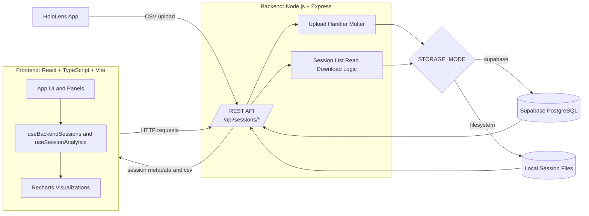

# GaitAnalytics

GaitAnalytics is the web platform for the FYP gait rehabilitation system. It includes:

1. A React dashboard for session review and visual analytics.
2. A Node.js backend API for CSV ingestion and session retrieval.

The system is currently hosted online for real-time demonstrations, and it can also be deployed manually in an offline/local environment when required.

## System Overview

1. HoloLens rehabilitation app uploads session CSV data to the backend API.
2. Backend stores session records (Supabase mode or filesystem mode).
3. Frontend dashboard fetches available sessions and loads selected CSV data.
4. Dashboard renders summary cards, anomaly insights, and charts.

## System Preview
### Main Dashboard


### Graphs


### Anomaly Detection


## Architecture Diagram



Diagram notes:

1. Frontend and backend are decoupled and communicate through REST endpoints.
2. Backend supports two persistence paths selected by `STORAGE_MODE`.
3. Supabase is used for persistent hosted deployment, while filesystem mode supports offline/local testing.

## Repository Structure

1. `src/`:
   Frontend React + TypeScript application.
2. `backend/`:
   Express API for uploads, listing sessions, and serving CSV content.

## Core Features

1. CSV upload endpoint (`/api/sessions/upload`)
2. Session listing endpoint (`/api/sessions`)
3. Read/download endpoints for individual sessions
4. Frontend session browser with backend auto-load on startup
5. Visual analytics (distance, speed, on/off-course, drift)
6. Lightweight anomaly scoring with selectable detector mode

## Tech Stack

### Frontend

1. React
2. TypeScript
3. Vite
4. Recharts
5. Papa Parse

### Backend

1. Node.js
2. Express
3. Multer
4. Supabase JavaScript client

### Deployment

1. Render (frontend static site + backend web service)
2. Supabase (persistent session storage)

## Online Hosting

This project is designed to run fully online:

1. Frontend hosted publicly (Render static site).
2. Backend hosted publicly (Render web service).
3. Supabase used for persistent session data.

This setup supports live demonstrations where HoloLens uploads can be viewed immediately in the dashboard.

## Manual Offline Deployment

If online services are unavailable, the project can be run manually in a local/offline setup.

### Prerequisites

1. Node.js 18+
2. npm

### Backend (local)

1. Open terminal in `backend/`
2. Install dependencies:

```bash
npm install
```

3. Configure environment file from `.env.example`.
4. Start backend:

```bash
npm run dev
```

### Frontend (local)

1. Open terminal in project root.
2. Install dependencies:

```bash
npm install
```

3. Start frontend:

```bash
npm run dev
```

4. In the dashboard backend URL field, set local API base URL (example: `http://localhost:4000`).

## Notes

1. Backend storage mode is controlled by environment variables.
2. For persistence in production, Supabase mode is recommended.
3. For isolated local testing, filesystem mode is available.

For backend storage and Supabase table setup, see `backend/README.md` and `backend/supabase-schema.sql`.
